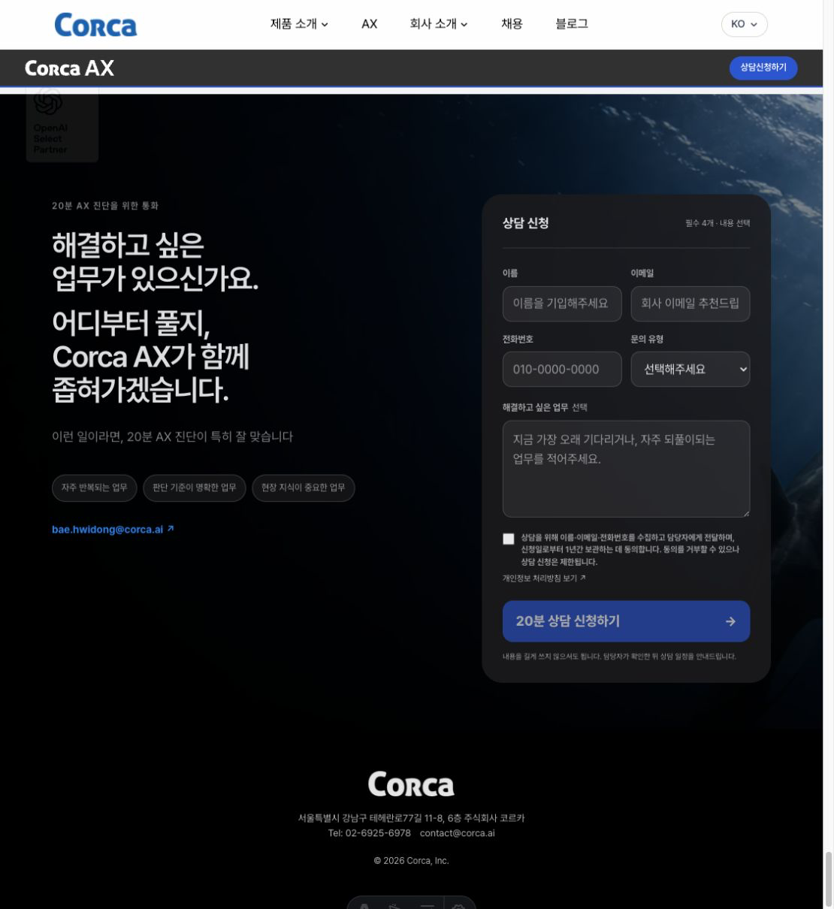
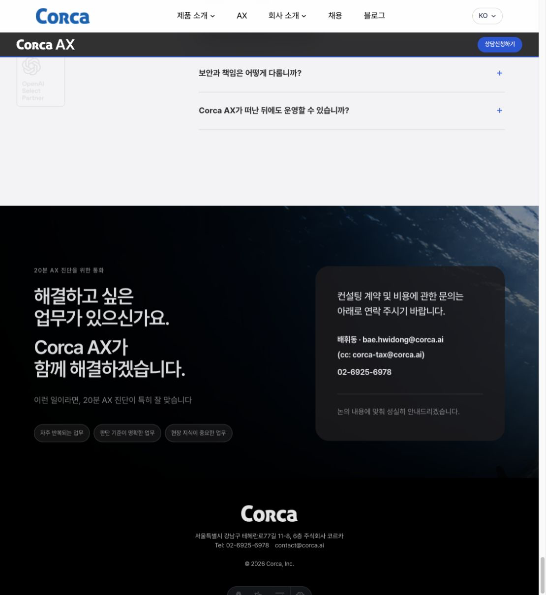
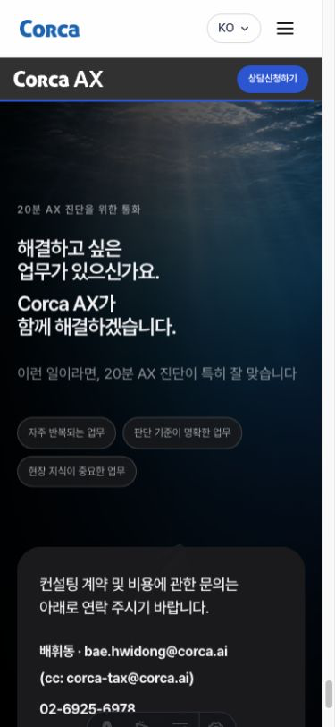

# AX email consultation design QA

- Source visual truth: `docs/design-qa/ax-contact-email-before.png`
- Desktop implementation: `docs/design-qa/ax-contact-email-after-desktop.png`
- Mobile implementation: `docs/design-qa/ax-contact-email-after-mobile.png`
- Primary viewport: `1125 × 1226`
- Mobile viewport: `390 × 844`
- Additional widths: `320`, `375`, `720`, `1000`, and `1280 px`
- State: Korean AX contact section with the consultation form disabled and direct contact details visible

| Source contact section | Revised desktop contact section |
| --- | --- |
|  |  |

## Full-view comparison evidence

The revised section preserves the existing orca image, dark scrim, two-column grid, heading scale, fit description, chips, card radius, and footer treatment. The requested content changes are intentional: the form is absent, the duplicate left-side email link is removed, the heading answer is shorter, and the right card contains only contract and fee contact details. Removing the form reduces the section's content height, so the same bottom-of-page viewport shows more of the preceding FAQ area; this is expected rather than layout drift.

## Focused region comparison evidence

The full desktop captures keep the complete changed region readable at the same width, so a separate desktop crop was unnecessary. The mobile capture adds focused responsive evidence for the heading, chips, and contact card at `390 px` wide.

## Findings and comparison history

1. **Initial — resolved, P1:** the existing consultation form conflicted with the requested email-only contact flow. It is now excluded from the DOM behind `showConsultationForm = false`; restoring the previous form is a one-line switch.
2. **Initial — resolved, P2:** the GNB and hero consultation links targeted `#ax-contact`, while a separate email link remained in the left column. Both CTAs now target `mailto:bae.hwidong@corca.ai`, and the left email link is removed.
3. **Initial — resolved, P2:** the contact answer copy did not match the annotation. Korean now renders exactly `Corca AX가 / 함께 해결하겠습니다.`, with equivalent English, Japanese, and Chinese copy.
4. **Accessibility pass — resolved, P2:** the replacement card initially lacked a heading relationship, the cc link could have changed cc into the primary recipient, and localized link targets measured below 24 px in some fonts. The card now uses `h3` plus `aria-labelledby`, both contact email links compose to Bae Hwidong with `corca-tax@corca.ai` in cc, CTA names announce the email action, and card links have a minimum 24 px target height.
5. **Final — passed:** four locales across seven widths produced no horizontal overflow, clipped card content, form remnants, or incorrect email/phone targets.

## Required fidelity surfaces

- Fonts and typography: existing Pretendard typography and heading hierarchy are preserved. The supplied contact details are bold, while the lead and closing retain quieter supporting weights.
- Spacing and layout rhythm: the original two-column contact grid and `28 px` card radius remain. The shorter direct-contact card intentionally reduces page height; tablet and mobile continue to stack copy before the card.
- Colors and visual tokens: the existing black surface, white primary copy, muted supporting copy, divider opacity, blue focus/hover treatment, and section scrim are reused.
- Image quality and assets: the existing final orca image, crop, responsive sources, and overlays are unchanged; no new visual asset or approximation was introduced.
- Copy and content: all Korean strings supplied in the annotations are rendered verbatim. English, Japanese, and Chinese pages use the same structure with localized text.

## Functional and accessibility verification

- GNB and hero CTAs use the exact `mailto:bae.hwidong@corca.ai` destination and retain existing analytics attributes.
- The primary contact email uses `mailto:bae.hwidong@corca.ai?cc=corca-tax@corca.ai`; the cc line opens the same correctly addressed message.
- The phone number uses `tel:+82269256978`.
- No form, input, consent, error, or form status region remains in the rendered DOM.
- The card is an `aside` labelled by its visible `h3`; email and phone links remain native keyboard-accessible anchors with visible focus styles.
- Link targets measure at least 24 px high, and the CTA accessible names explain that the action sends an email.
- Browser console produced no warnings or errors in the verified state.
- Biome, Astro diagnostics, knip, and the production build are recorded after the final verification run.

No actionable P0, P1, P2, or P3 findings remain.

final result: passed
